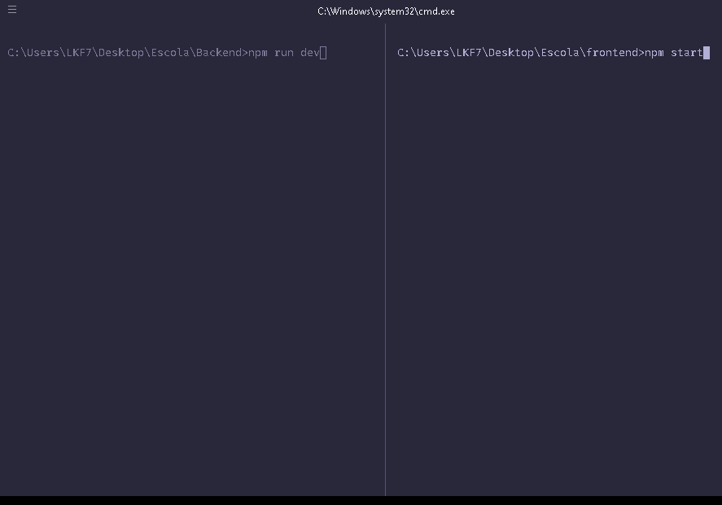
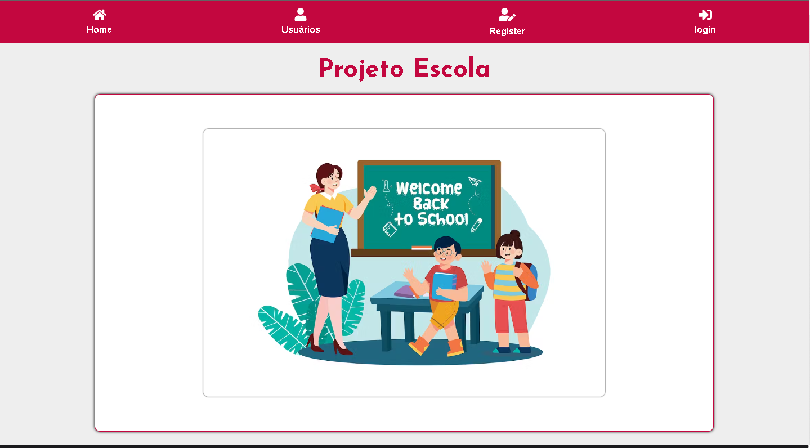
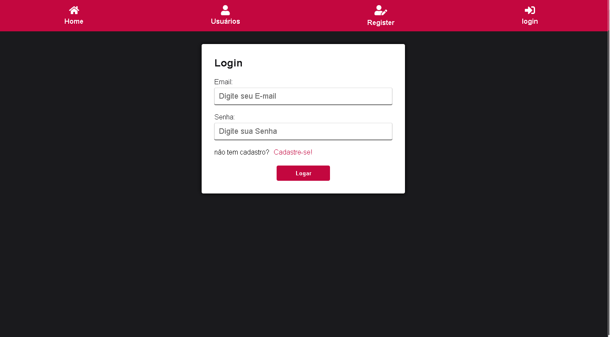
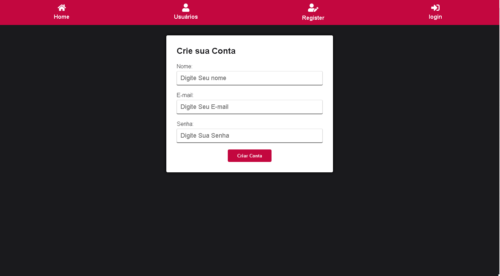
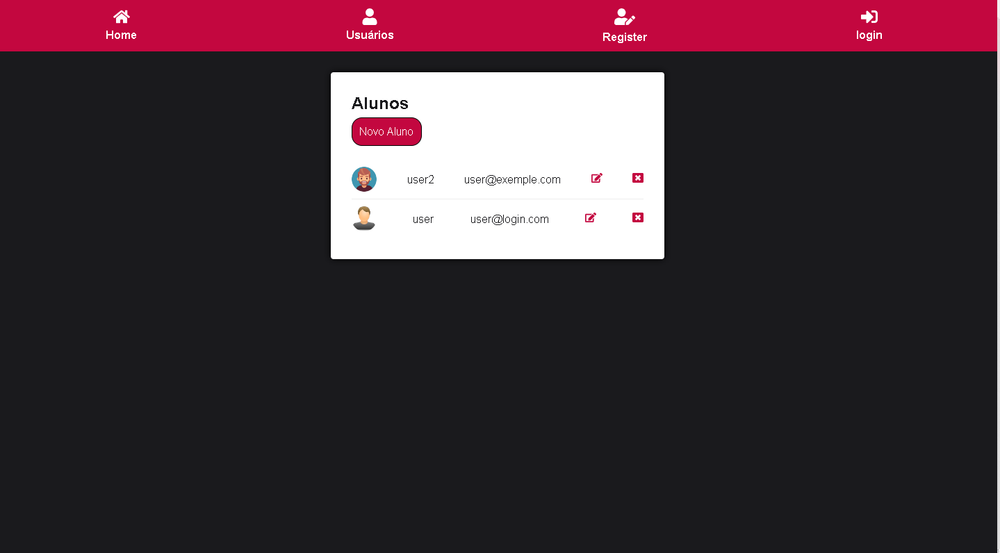
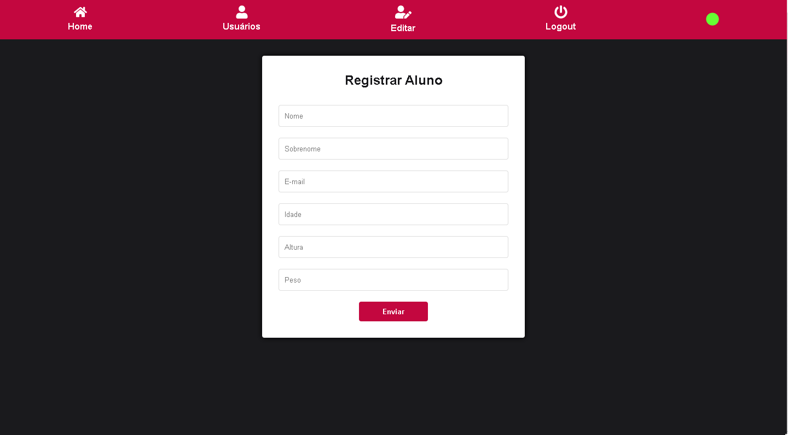
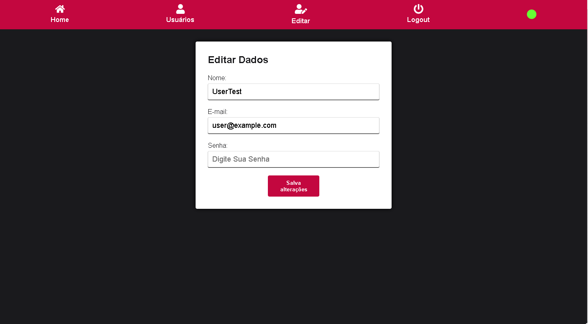
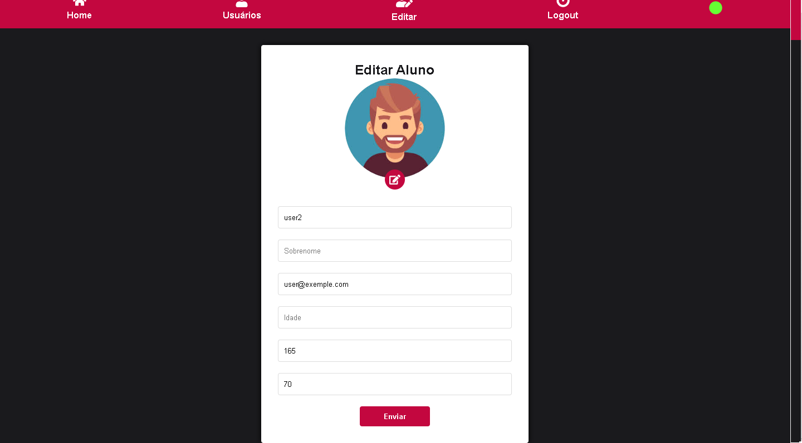
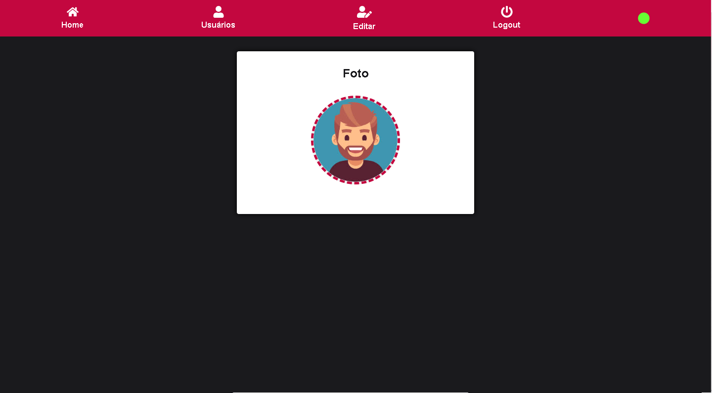

<h1 align="center"> Projeto Escola </h1>

 Nesse projeto Vamos introduzir o backend utilizando uma  Api_rest com React: </h2> 
<h2 align="left"> Primeiro passo : </h2> 
 
 Faça o import da pasta db_projeto  no MySql workbanch 

<h2 align=""left>Segundo Passo : </h2>

 Executar backend e  frontend 

<h2 align="center"> Abra dois terminal um para roda Backend e outro frontend </h2>
  

   
 Cada Pasta frontend & Backend contem Readme Sobre projeto

    
  

 

<h1 align="center">  imagem do Projeto </h1>

## homePage do Projeto

## Area do Projeto Login

## Area do Projeto Cria Conta

## Area do Projeto interface dos usuario

## Area do Projeto Registro

## Area do Projeto Editar dado do aluno

## Area do Projeto Editar aluno

## Area do Projeto Alterar foto

